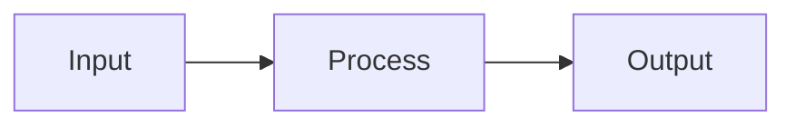

# Markdown Files

## Diagrams

Always use Mermaid for diagrams in markdown files.

```markdown

```

Supported diagram types:
- `flowchart` - Process flows, architecture diagrams
- `sequenceDiagram` - API calls, component interactions
- `erDiagram` - Data models, relationships
- `gantt` - Timelines, project plans
- `classDiagram` - Class structures

Syntax notes:
- Escape special characters in node text by wrapping in quotes: `A["text with {braces}"]`
- Curly braces `{}` are parsed as diamond nodes, so `A[value = {foo}]` will fail
- Use `<br/>` for line breaks inside nodes

Do not use:
- ASCII art diagrams
- External image links for diagrams
- PlantUML or other diagram formats
