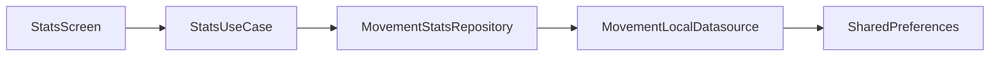

# Change Plan: Movement Statistics Screen

**Status**: Applied

## Background

The app already collects movement events (`movement_events` in SharedPreferences) with timestamp, sedentary duration, reaction time, and source. But this data is never shown to the user. A statistics screen gives users feedback on their habits and motivation to keep moving.

## Goal

Add a statistics screen accessible from the home screen that shows:
- Today's summary (movement count, total sedentary time, average reaction time)
- Weekly chart (movements per day, last 7 work days)
- Streak tracker (consecutive days with at least 1 movement)
- All-time stats (total movements, averages)

## Architecture

Follows the feature-first pattern: `lib/features/movement_stats/` with domain/data/presentation layers. Reuses existing `MovementLocalDatasource` and `MovementEventModel` from the movement feature.



## Affected Files

### New files

#### Domain layer
- `lib/features/movement_stats/domain/entities/movement_stats.dart` - Stats data classes (DailyStats, WeeklyStats, StreakInfo)
- `lib/features/movement_stats/domain/repositories/movement_stats_repository.dart` - Abstract repository interface
- `lib/features/movement_stats/domain/usecases/get_movement_stats_use_case.dart` - Computes all statistics from raw events

#### Data layer
- `lib/features/movement_stats/data/repositories/movement_stats_repository_impl.dart` - Reads events from existing datasource, delegates computation to use case

#### Presentation layer
- `lib/features/movement_stats/presentation/stats_screen.dart` - Main statistics screen
- `lib/features/movement_stats/presentation/widgets/today_summary_card.dart` - Today's numbers
- `lib/features/movement_stats/presentation/widgets/weekly_chart.dart` - Bar chart (last 7 days)
- `lib/features/movement_stats/presentation/widgets/streak_card.dart` - Current and best streak

### Modified files
- `lib/screens/home_screen.dart` - Add navigation button to stats screen
- `lib/features/movement/data/datasources/movement_local_datasource.dart` - Add `getEvents()` to public API if not already exposed through repository
- `lib/features/movement/domain/repositories/movement_repository.dart` - Add `getEvents()` method to interface

### Test files
- `test/features/movement_stats/domain/usecases/get_movement_stats_use_case_test.dart` - Unit tests for stats computation
- `test/features/movement_stats/domain/entities/movement_stats_test.dart` - Entity tests
- `test/features/movement_stats/data/repositories/movement_stats_repository_impl_test.dart` - Repository tests

## Implementation Steps

### Step 1: Expose getEvents in movement repository

Add `Future<List<MovementEvent>> getEvents()` to `MovementRepository` interface and implement in `MovementRepositoryImpl`. The datasource method already exists.

### Step 2: Create domain entities

```dart
class DailyStats {
  final DateTime date;
  final int movementCount;
  final Duration totalSedentaryTime;
  final Duration averageReactionTime;
}

class StreakInfo {
  final int currentStreak; // consecutive days with >= 1 movement
  final int bestStreak;
}

class MovementStats {
  final DailyStats today;
  final List<DailyStats> weeklyStats; // last 7 days
  final StreakInfo streak;
  final int totalMovements;
  final Duration allTimeAverageReaction;
  final Duration allTimeAverageSedentary;
}
```

### Step 3: Create GetMovementStatsUseCase

Pure Dart class. Takes list of `MovementEvent`, computes `MovementStats`. All logic is pure functions for easy testing:
- Group events by date
- Calculate daily aggregates
- Walk dates backward to compute streak
- Compute all-time averages

### Step 4: Create repository layer

`MovementStatsRepositoryImpl` takes `MovementRepository` via constructor injection. Fetches events, passes to use case, returns `MovementStats`.

### Step 5: Build stats screen

`StatsScreen` - StatefulWidget that loads stats on init. Three cards stacked vertically in a scrollable view:

1. **TodaySummaryCard** - three key numbers in a row: movement count, total sedentary time, average reaction time
2. **WeeklyChart** - bar chart using `fl_chart`. 7 bars for last 7 work days, day labels, movement count on Y axis
3. **StreakCard** - current streak number prominently, best streak smaller

UI style: match existing glassmorphism design, use `AppColors` theme. All text in Russian.

### Step 6: Add navigation from home screen

Add an icon button (bar chart icon) in the home screen app bar or as a new card. Navigates to `StatsScreen` via `Navigator.push`.

### Step 7: Write tests

- `GetMovementStatsUseCase` - test with empty data, single day, multiple days, streak calculation, edge cases (midnight boundary)
- `MovementStats` entities - equality, edge values
- `MovementStatsRepositoryImpl` - mock repository, verify delegation

## Testing Checklist

- [ ] Stats use case: empty events returns zero stats
- [ ] Stats use case: single event today shows correct daily stats
- [ ] Stats use case: events across 7 days produce correct weekly data
- [ ] Stats use case: streak counts consecutive days correctly
- [ ] Stats use case: gap in days resets current streak
- [ ] Stats use case: all-time averages computed correctly
- [ ] Repository impl delegates to datasource and use case
- [ ] All existing tests still pass

## Rollback Plan

Delete `lib/features/movement_stats/` directory, remove navigation button from home screen, revert changes to `MovementRepository` interface. No data migration needed - we only read existing data, never modify it.

## Decisions

1. **Chart library**: `fl_chart` - faster to build, good quality charts
2. **Data retention**: SharedPreferences only, no SQLite. Fine for current scale (~2,500 events/year)
3. **Weekly chart scope**: Last 7 work days (respects user's Saturday/Sunday settings from `UserPreferences`)

## Benefits

- Users see the impact of their movement habits
- Streak mechanic adds motivation to keep using the app
- Increases daily retention (reason to open the app beyond configuration)
- One new dependency (`fl_chart`), no backend, no data migration

## Estimated Scope

Medium. ~10 new files, 2 modified files, 1 new dependency. Mostly Dart, no native changes needed.
